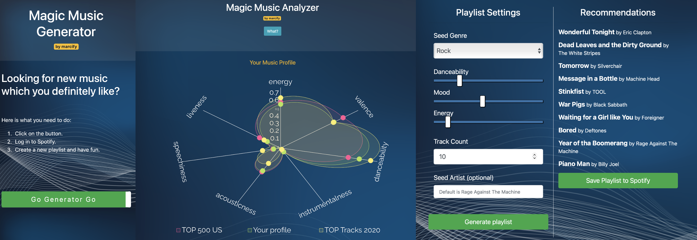

   


# About the project
Mood-based playlist generator and analyzer. Create personal playlists based on self chosen preferences.


This is an step-by-step guide how to deploy a Flask-App on render.com. I use the free tier without a database.

The original project is hosted on Heroku. The source for that can be found [here](https://github.com/marwonn/spotify-playlist-generator-analyzer).
<br/><br/>
__________
## Table of Contents
  <ul>
    <li>
      <a href="#about-the-project">About the project</a>
    </li>
    <li>
      <a href="#getting-started">Getting Started</a>
      <ul>
        <li><a href="#prerequisites">Prerequisites</a></li>
        <li><a href="#spotify">Authenticate App to Spotify</a></li>
        <li><a href="#render">Deploy App on Render</a></li>
      </ul>
    </li>
    <li><a href="#frontend">Setting options - frontend</a></li>
    <li><a href="#links">Links & Resources</a></li>
    <li><a href="#license">License</a></li>
  </ul>

__________
## Getting Started
### Prerequisites
- A [Spotify Developer Account](https://developer.spotify.com) is needed. I use the free version.
- An account on [render](https://render.com) is needed. I use the free plan version.
- A GitHub Account is needed.
- Clone or fork this project.

### Authenticate App to Spotify
- Go to your [dashboard](https://developer.spotify.com/dashboard/) and create a new app. 
- Edit settings an add a redirect URL. The redirect URL should look like this https://*NAME-OF-YOUR-WEB-SERVICE-ON-RENDER*.onrender.com/spotify-oauth2callback
- Go to 'User and Access' and add a new user. I use my personal Spotify account. Adding up to 25 users is possible in the free version.

### Deploy App on Render
- Go to your [dashboard](https://dashboard.render.com) and add a new 'Web Service'.
- Connect your GitHub account and specify the repository url.
- Adjust the follwowing entries:
   - Name: Needs to be the same as in the redirect URL.
   - Region: Choose your region.
   - Root directory: Stays unchanged.
   - Start command: Change to ```gunicorn wsgi:app``` (as defined in ```wsgi.py```).
   - Add evironment variables (Key:Value):
     - REDIRECT_URL:https://*NAME-OF-YOUR-WEB-SERVICE-ON-RENDER*.onrender.com/spotify-oauth2callback
     - SECRET_KEY:Random secret like 1234
     - SPOTIFY_CLIENT_ID:can be found under your [dashboard](https://dashboard.render.com) 
     - SPOTIFY_CLIENT_SECRET:can be found under your [dashboard](https://dashboard.render.com)
     - USERNAME:your spotify user name
- Click on 'deploy', wait and enjoy.

## Setting options - frontend:

- Danceability describes how suitable a track is for dancing based on a combination of musical elements including tempo, rhythm stability, beat strength, and overall regularity. A value of 0.0 is least danceable and 1.0 is most danceable.

- Energy is a measure from 0.0 to 1.0 and represents a perceptual measure of intensity and activity. Typically, energetic tracks feel fast, loud, and noisy. For example, death metal has high energy, while a Bach prelude scores low on the scale. Perceptual features contributing to this attribute include dynamic range, perceived loudness, timbre, onset rate, and general entropy.

- Valance: A measure from 0.0 to 1.0 describing the musical positiveness conveyed by a track. Tracks with high valence sound more positive (e.g. happy, cheerful, euphoric), while tracks with low valence sound more negative (e.g. sad, depressed, angry).

- Track count: Number of tracks which will be searched and saved by the script.

- Seed genre: Search of tracks is derived from a choosen seed genre.

## Links & Resources
[My original repository](https://github.com/marwonn/spotify-playlist-generator-analyzer)

[Spotify Audio Features & Analysis](https://developer.spotify.com/discover/#audio-features-analysis)

## License
Publishes under the GNU General Public License v3.0 License. See `LICENSE` for more information.

